  <h3>💡 "Building scalable data pipelines and cloud infrastructure, one commit at a time" 💡</h3>
  
  <i>Proudly coding from the Lone Star State</i>

---

## 🎮 Interactive Architecture Hub

  <h3>🔗 Explore My Live DevOps Demonstrations</h3>
  
<i>Click on any diagram below to interact with live demos and detailed architecture breakdowns</i>

### 🏗️ Infrastructure Diagrams & Live Demos

  <table>
    <tr>
      <td align="center" width="300">
        
         
        <b>Interactive K8s Dashboard</b> Real-time pod monitoring & scaling demos
      </td>
      <td align="center" width="300">
        
         
        <b>Live Data Processing</b> Watch data flow through ETL stages
      </td>
      <td align="center" width="300">
        
         
        <b>Real-time Deployments</b> Live pipeline execution viewer
      </td>
    </tr>
    <tr>
      <td align="center">
        
         
        <b>3D Cloud Architecture</b> Interactive AWS/Azure/GCP topology
      </td>
      <td align="center">
        
         
        <b>Grafana Live View</b> Real-time metrics & alerting
      </td>
      <td align="center">
        
         
        <b>Security Posture</b> Live vulnerability scanning results
      </td>
    </tr>
  </table>

### 🎯 Interactive Pipeline Simulators

  <table>
    <tr>
      <td align="center">
        <h4>🏗️ Infrastructure Pipeline Simulator</h4>
        
         
        

          
🔠Pipeline Features

          <ul align="left">
            <li>✅ Multi-environment deployment (dev/staging/prod)</li>
            <li>🔒 Security scanning with Checkov & tfsec</li>
            <li>💰 Cost analysis with Infracost</li>
            <li>📊 Compliance checking (CIS benchmarks)</li>
            <li>🚨 Automated rollback on failures</li>
            <li>📋 Drift detection & remediation</li>
          </ul>
        

      </td>
      <td align="center">
        <h4>📱 Application Pipeline Simulator</h4>
        
         
        

          
🔠Pipeline Features

          <ul align="left">
            <li>🧪 Multi-language testing (Python/Node/Go)</li>
            <li>🔒 SAST/DAST security scanning</li>
            <li>🐳 Multi-arch container builds</li>
            <li>📊 Performance & load testing</li>
            <li>🎯 Canary deployments with Argo</li>
            <li>🔄 GitOps workflow integration</li>
          </ul>
        

      </td>
    </tr>
  </table>

### 📊 Live Architecture Metrics

  <iframe src="https://grafana.com/api/dashboards/1860/revisions/37/download" width="100%" height="400" frameborder="0" style="border-radius: 8px; background: #1a1a1a;"></iframe>
  
<i>Live infrastructure metrics from my homelab Kubernetes cluster</i>

### 🎮 Try It Yourself - Interactive Demos

  <table>
    <tr>
      <th>🎯 Demo</th>
      <th>🛠️ Technology</th>
      <th>🔗 Action</th>
      <th>📝 Description</th>
    </tr>
    <tr>
      <td><b>Kubernetes Scaling</b></td>
      <td>K8s + HPA</td>
      <td>
        
      </td>
      <td>Scale pods in real-time, watch auto-scaling in action</td>
    </tr>
    <tr>
      <td><b>Terraform Apply</b></td>
      <td>IaC + AWS</td>
      <td>
        
      </td>
      <td>Deploy real AWS resources with my Terraform modules</td>
    </tr# Hi there! 👋 I'm Jose

  

  
  

---

## 🚀 About Me

- 🏠 **Based in:** Texas, USA 🤠
- 🔭 **Currently Building:** [Core Infrastructure Project](https://github.com/joselrnz/core-infrastructure)
- 💬 **Ask me about:** Math, Data Engineering, Cloud Architecture, DevOps, Infrastructure
- ⚡ **Fun fact:** I enjoy tinkering with tech tools and building scalable systems
- 🌱 **Learning:** Advanced Kubernetes orchestration and ML Ops pipelines
- 🎯 **Goal:** Contributing to open-source data and infrastructure projects

---

## 🛠️ Tech Arsenal

### Programming Languages

  

### Cloud Platforms & DevOps

  
  

### Data Engineering & Databases

  
  
  
  
  
  

### Frameworks & Tools

  
  
  
  
  

---

## 📊 GitHub Analytics

  
  

  

---

## 🏆 GitHub Trophies

  

---

## 📈 Activity Graph

  

---

## ⚙️ Interactive DevOps Pipeline

  
---

## ⚙️ Enterprise DevOps Pipelines

### 🏗️ Infrastructure as Code (IaC) Pipeline

```mermaid
flowchart TD
    subgraph "🔧 Infrastructure CI Pipeline"
        A1[📝 Terraform Code Push<br/>infra/aws-data-platform] --> B1[⚡ GitHub Actions Trigger<br/>IaC Workflow]
        B1 --> C1[🏗️ Setup Environment<br/>Terraform Cloud Agent]
        C1 --> D1[📦 Install Tools<br/>Terraform, tflint, checkov]
        D1 --> E1{🧪 Terraform Validate}
        E1 -->|✅ Valid| F1[🔍 Security Scan<br/>Checkov, tfsec, Snyk]
        E1 -->|❌ Invalid| Z1[🚫 Pipeline Failed<br/>Syntax Errors]
        F1 -->|✅ Secure| G1[💰 Cost Analysis<br/>Infracost Estimation]
        F1 -->|❌ Security Issues| Z1
        G1 -->|✅ Budget OK| H1[📋 Terraform Plan<br/>Generate Execution Plan]
        G1 -->|❌ Over Budget| W1[⚠️ Cost Alert<br/>Manual Review Required]
        H1 --> I1[👀 Plan Review<br/>GitHub PR Comments]
    end
    
    subgraph "🚀 Infrastructure CD Pipeline"
        I1 --> J1[✋ Manual Approval<br/>Senior Cloud Architect]
        J1 -->|👍 Approved| K1[🌩️ Terraform Apply<br/>Dev Environment]
        J1 -->|👎 Rejected| Y1[🔄 Back to Development]
        K1 --> L1[🧪 Infrastructure Tests<br/>Terratest, InSpec]
        L1 -->|✅ Pass| M1[📊 Compliance Check<br/>CIS Benchmarks, SOC2]
        L1 -->|❌ Fail| Y1
        M1 -->|✅ Compliant| N1[🔄 Apply to Staging<br/>Blue-Green Infrastructure]
        M1 -->|❌ Non-Compliant| Y1
        N1 --> O1[🎯 Apply to Production<br/>Canary Deployment]
        O1 --> P1[📈 Resource Monitoring<br/>CloudWatch, Datadog]
        P1 --> Q1[✨ IaC Deployment Complete<br/>Teams Notification]
    end
    
    subgraph "🔒 Security & Compliance"
        Q1 --> R1[🛡️ Security Posture<br/>AWS Config, Security Hub]
        Q1 --> S1[📊 Cost Optimization<br/>AWS Trusted Advisor]
        Q1 --> T1[🔔 Alert Setup<br/>PagerDuty, OpsGenie]
    end
    
    style A1 fill:#FF6B35,color:#ffffff
    style B1 fill:#FF6B35,color:#ffffff
    style C1 fill:#4A90E2,color:#ffffff
    style D1 fill:#4A90E2,color:#ffffff
    style E1 fill:#D32F2F,color:#ffffff
    style F1 fill:#9C27B0,color:#ffffff
    style G1 fill:#FF9800,color:#ffffff
    style H1 fill:#4A90E2,color:#ffffff
    style I1 fill:#FF6B35,color:#ffffff
    style J1 fill:#D32F2F,color:#ffffff
    style K1 fill:#4CAF50,color:#ffffff
    style L1 fill:#D32F2F,color:#ffffff
    style M1 fill:#9C27B0,color:#ffffff
    style N1 fill:#4CAF50,color:#ffffff
    style O1 fill:#4CAF50,color:#ffffff
    style P1 fill:#FF9800,color:#ffffff
    style Q1 fill:#4CAF50,color:#ffffff
    style R1 fill:#9C27B0,color:#ffffff
    style S1 fill:#FF9800,color:#ffffff
    style T1 fill:#D32F2F,color:#ffffff
    style W1 fill:#FF9800,color:#ffffff
    style Y1 fill:#FF9800,color:#ffffff
    style Z1 fill:#D32F2F,color:#ffffff
```

### 📱 Application Deployment Pipeline

### 📊 Pipeline Performance Dashboard

  <table>
    <tr>
      <th colspan="6">🏗️ Infrastructure Pipeline Metrics</th>
    </tr>
    <tr>
      <th>🔧 Stage</th>
      <th>⚙️ Tools</th>
      <th>⏱️ Duration</th>
      <th>✅ Success Rate</th>
      <th>💰 Cost Impact</th>
      <th>🔒 Security Score</th>
    </tr>
    <tr>
      <td><b>Terraform Validate</b></td>
      <td>terraform, tflint</td>
      <td>~1 min</td>
      <td>99.2%</td>
      <td>$0</td>
      <td>N/A</td>
    </tr>
    <tr>
      <td><b>Security Scan</b></td>
      <td>Checkov, tfsec, Snyk</td>
      <td>~3 min</td>
      <td>96.8%</td>
      <td>$0</td>
      <td>98.5/100</td>
    </tr>
    <tr>
      <td><b>Cost Analysis</b></td>
      <td>Infracost</td>
      <td>~2 min</td>
      <td>100%</td>
      <td>+$247/mo</td>
      <td>N/A</td>
    </tr>
    <tr>
      <td><b>Apply Infrastructure</b></td>
      <td>Terraform Cloud</td>
      <td>~8 min</td>
      <td>99.1%</td>
      <td>Variable</td>
      <td>N/A</td>
    </tr>
    <tr>
      <td><b>Compliance Check</b></td>
      <td>InSpec, CIS</td>
      <td>~4 min</td>
      <td>97.3%</td>
      <td>$0</td>
      <td>96.2/100</td>
    </tr>
  </table>
  
   
  
  <table>
    <tr>
      <th colspan="6">📱 Application Pipeline Metrics</th>
    </tr>
    <tr>
      <th>🔧 Stage</th>
      <th>⚙️ Tools</th>
      <th>⏱️ Duration</th>
      <th>✅ Success Rate</th>
      <th>📊 Coverage</th>
      <th>🔒 Security Score</th>
    </tr>
    <tr>
      <td><b>Unit Tests</b></td>
      <td>pytest, jest, go test</td>
      <td>~4 min</td>
      <td>98.7%</td>
      <td>87.3%</td>
      <td>N/A</td>
    </tr>
    <tr>
      <td><b>SAST Scan</b></td>
      <td>Semgrep, CodeQL</td>
      <td>~6 min</td>
      <td>94.2%</td>
      <td>100%</td>
      <td>94.8/100</td>
    </tr>
    <tr>
      <td><b>Container Security</b></td>
      <td>Trivy, Grype</td>
      <td>~3 min</td>
      <td>96.5%</td>
      <td>100%</td>
      <td>97.1/100</td>
    </tr>
    <tr>
      <td><b>DAST Scan</b></td>
      <td>OWASP ZAP</td>
      <td>~12 min</td>
      <td>92.3%</td>
      <td>100%</td>
      <td>93.7/100</td>
    </tr>
    <tr>
      <td><b>Performance Test</b></td>
      <td>K6, Artillery</td>
      <td>~8 min</td>
      <td>95.1%</td>
      <td>N/A</td>
      <td>N/A</td>
    </tr>
    <tr>
      <td><b>Canary Deployment</b></td>
      <td>Argo Rollouts</td>
      <td>~15 min</td>
      <td>99.4%</td>
      <td>N/A</td>
      <td>N/A</td>
    </tr>
  </table>

### 🛡️ Security-First Approach

  <table>
    <tr>
      <th>🔒 Security Layer</th>
      <th>🛠️ Tools & Techniques</th>
      <th>📊 Coverage</th>
      <th>🎯 Purpose</th>
    </tr>
    <tr>
      <td><b>🏗️ Infrastructure Security</b></td>
      <td>Checkov, tfsec, Terraform Sentinel</td>
      <td>100%</td>
      <td>Prevent misconfigurations</td>
    </tr>
    <tr>
      <td><b>🔍 Static Analysis (SAST)</b></td>
      <td>SonarQube, Semgrep, CodeQL</td>
      <td>95%</td>
      <td>Find code vulnerabilities</td>
    </tr>
    <tr>
      <td><b>📦 Dependency Scanning</b></td>
      <td>Snyk, GitHub Dependabot</td>
      <td>100%</td>
      <td>Vulnerable packages detection</td>
    </tr>
    <tr>
      <td><b>🐳 Container Security</b></td>
      <td>Trivy, Grype, Clair</td>
      <td>100%</td>
      <td>Image vulnerability scanning</td>
    </tr>
    <tr>
      <td><b>🌐 Dynamic Analysis (DAST)</b></td>
      <td>OWASP ZAP, Burp Suite</td>
      <td>85%</td>
      <td>Runtime vulnerability testing</td>
    </tr>
    <tr>
      <td><b>📜 License Compliance</b></td>
      <td>FOSSA, WhiteSource</td>
      <td>100%</td>
      <td>Open source license risks</td>
    </tr>
    <tr>
      <td><b>📋 Software Bill of Materials</b></td>
      <td>Syft, CycloneDX</td>
      <td>100%</td>
      <td>Component transparency</td>
    </tr>
    <tr>
      <td><b>☁️ Cloud Security Posture</b></td>
      <td>AWS Config, Security Hub</td>
      <td>100%</td>
      <td>Continuous compliance</td>
    </tr>
  </table>

### ☸️ Kubernetes Cluster Architecture

```mermaid
graph TB
    subgraph "🏠 Texas Data Center"
        subgraph "☸️ Kubernetes Cluster"
            subgraph "🎛️ Control Plane"
                API[API Server]
                ETCD[etcd]
                SCHED[Scheduler]
                CM[Controller Manager]
            end
            
            subgraph "💪 Worker Nodes"
                subgraph "Node 1"
                    POD1[📦 Data Pipeline Pods]
                    POD2[🔍 Monitoring Pods]
                end
                subgraph "Node 2"
                    POD3[🌐 API Gateway Pods]
                    POD4[📊 Analytics Pods]
                end
                subgraph "Node 3"
                    POD5[🗄️ Database Pods]
                    POD6[🚀 Cache Pods]
                end
            end
        end
        
        subgraph "🔧 Supporting Services"
            LB[⚖️ Load Balancer]
            INGRESS[🚪 Ingress Controller]
            STORAGE[💾 Persistent Storage]
        end
    end
    
    subgraph "☁️ Cloud Services"
        MONITOR[📈 Grafana/Prometheus]
        LOGS[📋 ELK Stack]
        REGISTRY[📦 Container Registry]
    end
    
    LB --> INGRESS
    INGRESS --> POD3
    POD1 --> STORAGE
    POD5 --> STORAGE
    
    MONITOR -.-> POD2
    LOGS -.-> POD2
    REGISTRY -.-> POD1
    REGISTRY -.-> POD3
    REGISTRY -.-> POD5
    
    style API fill:#4CAF50
    style ETCD fill:#FF9800
    style POD1 fill:#2196F3
    style POD3 fill:#9C27B0
    style POD5 fill:#F44336
    style MONITOR fill:#795548
    style LOGS fill:#607D8B
```

### 🛠️ My DevOps Toolkit

  <table>
    <tr>
      <td align="center">
        
         Automated Pipelines
      </td>
      <td align="center">
        
         Container Management
      </td>
      <td align="center">
        
         Application Packaging
      </td>
    </tr>
    <tr>
      <td align="center">
        
         System Observability
      </td>
      <td align="center">
        
         Infrastructure as Code
      </td>
      <td align="center">
        
         AWS | Azure | GCP
      </td>
    </tr>
  </table>

### 📊 Data Pipeline Flow

```mermaid
flowchart TD
    A[📥 Data Ingestion<br/>Kafka/Kinesis] --> B[🔄 Stream Processing<br/>Apache Spark]
    B --> C[🧹 Data Cleaning<br/>Python/Pandas]
    C --> D[🏪 Data Lake<br/>S3/ADLS/GCS]
    D --> E[⚙️ ETL Pipeline<br/>Airflow/Dagster]
    E --> F[🗄️ Data Warehouse<br/>Snowflake/BigQuery]
    F --> G[📈 Analytics<br/>Tableau/PowerBI]
    
    H[🔍 Monitoring<br/>Prometheus] -.-> B
    H -.-> E
    I[📋 Logging<br/>ELK Stack] -.-> C
    I -.-> E
    
    style A fill:#e1f5fe
    style B fill:#fff3e0
    style C fill:#e8f5e8
    style D fill:#fce4ec
    style E fill:#f3e5f5
    style F fill:#e0f2f1
    style G fill:#e8eaf6
    style H fill:#fff9c4
    style I fill:#f1f8e9
```

---

## 🌟 Featured Projects

  

---

## 🤝 Let's Connect

  
  

---

  <h3>💡 "Building scalable data pipelines and cloud infrastructure, one commit at a time" 💡</h3>
  
  <i>Proudly coding from the Lone Star State</i>

